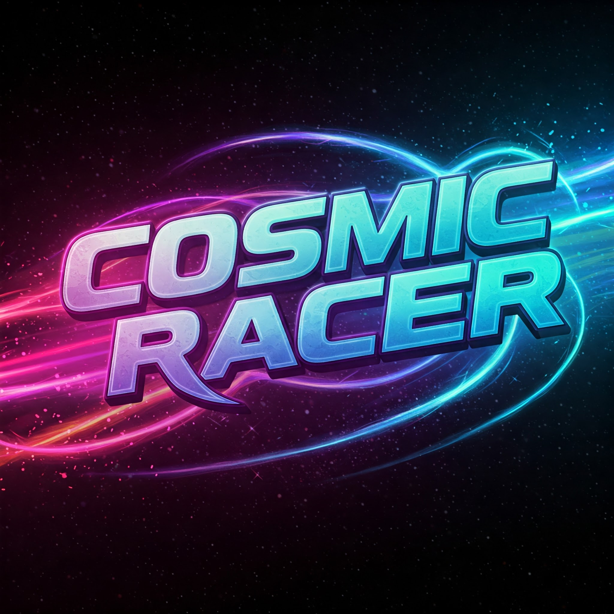
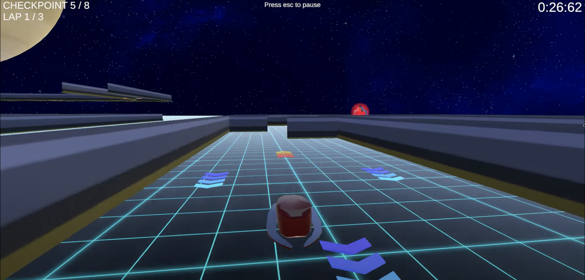
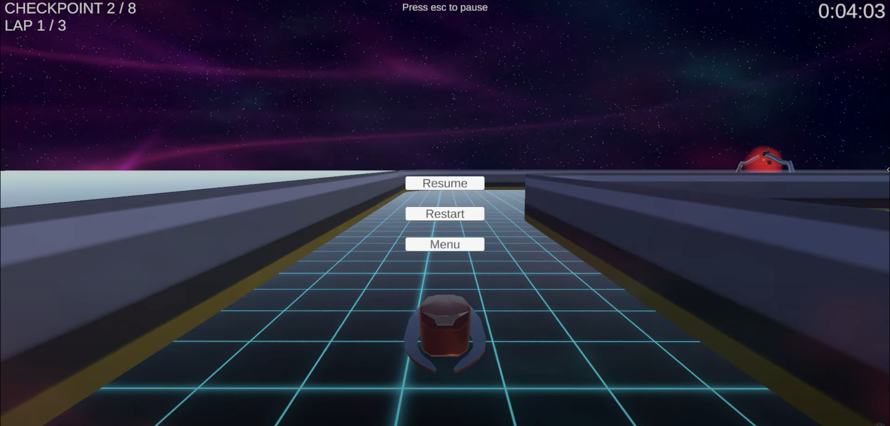

# Cosmic Racer

## [>>>Play Demo Here<<<](https://cosmical-racer.netlify.app/)

>  Racing game with exciting tracks and high-velocities! - built as a portfolio piece to showcase game development skills.

## 🏎️ About Cosmic Racer

Cosmic Racer is a fast and exhilarating arcade-style racing game set in a vibrant, futuristic world.  Developed as a personal portfolio project, it's designed to demonstrate skills in game development, including: Gameplay programming,  3D environment design and Vehicle control mechanics.

The game focuses on delivering a fun and immediately accessible racing experience. While a smaller project in scope, Cosmic Racer aims to showcase a complete game development workflow from concept to playable demo.

This is only the start and this game demo will be further developed and new exciting features like new tracks, leaderboard and opponents will be added.

## ✨ Key Features

* **Arcade Racing Gameplay:**  Fast-paced, drift-heavy racing focused on fun and immediate action.
* **Futuristic Tracks:**  Visually appealing circuits set in stylized, sci-fi environments.
* **Boostpads and Traps:**  Use boostpads to speed up and complete race in lessser time, but be careful: boostapds do not always face forward.
* **Time Trials:**  Race against the clock to beat your best times.
* **Portfolio Focused Development:**  Designed and built from scratch as a demonstration of game development skills.

## 🖼️ Screenshots

>  High-speed racing action on a futuristic track.

>  A glimpse of track environment.

> Pause Menu Interface

## 🚀 How to Play

**Controls:**

* **Accelerate:** [Key/Button] - e.g., "Up Arrow / W"
* **Steer Left:** [Key/Button] - e.g., "Left Arrow / A"
* **Steer Right:** [Key/Button] - e.g., "Right Arrow / D"
* **Brake/Backwards movement:** [Key/Button] - e.g., "Down Arrow / S"

**Objective:**

* "Complete the race as fast as possible!"

## 🛠️ Development Status

* **Status:** Portfolio Project - Complete Demo
* **Key Milestones:**
    * Core racing mechanics implemented.
    * Unique track designed and built.
    * Playable demo created to showcase core gameplay.
* **Known Issues:**
    * Two freezes near beginning of the race

**Note:**  Cosmic Racer is a portfolio project demonstrating game development skills.  It represents a focused effort to build a playable and engaging racing game demo within a limited scope.

## 🤝 Contributing (Personal Project)

As a solo portfolio project, Cosmic Racer is primarily intended to showcase my individual skills.  While I appreciate interest in contributing, this project is not currently set up for external contributions.

However, feedback and suggestions are always welcome! If you have thoughts on the game, feel free to shoot an email to anton.ivanov.forwork@gmail.com. Will be glad to read all comments/reccomendations.

## ❤️ Credits

* **Anton:**  Sole Developer - Programming, Design, Art, etc.
* **Metropolia's Unity Game Programming course:** Assets, code and inspiration.

## 🔗 Links

* **Playable Demo:** [Play Cosmic Racer in your browser!](https://cosmical-racer.netlify.app/)
* **WebGL GitHub Repository:** [Cosmic Racer's WebGL GitHub repository](https://github.com/gluck243/Cosmic-Racer-WebGL)

---

**Thank you for checking out Cosmic Racer!  I hope you enjoy the race!**  🚀 ✨